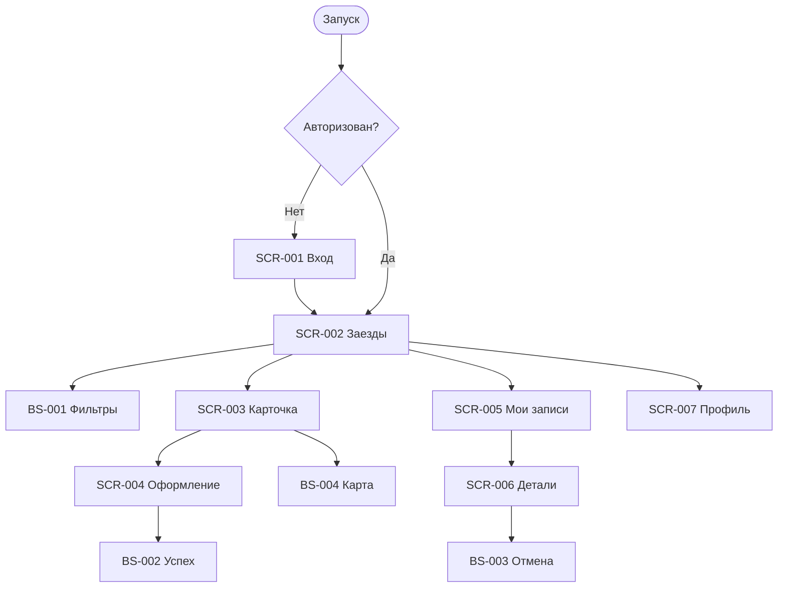

# Бриф для UI/UX дизайнера · «Апекс»

> Требования на дизайн клиентского мобильного приложения картинг-центра «Апекс».

**Статус:** Черновик  
**Источники:** [BR](../2-requirements/business-requirements.md), [FR](../2-requirements/functional-requirements.md), [NFR](../2-requirements/non-functional-requirements.md), [Use cases](../2-requirements/use-cases.md), [User stories](../2-requirements/user-stories.md)

## Цель и контекст

Приложение заменяет ручную запись через Telegram и маркерную доску. Клиент самостоятельно просматривает заезды, фильтрует слоты, бронирует места для себя и гостей, выбирает экипировку, отменяет записи и получает уведомления.

Платформа реализации — Flutter-приложение для iOS и Android. Скоуп дизайна — только клиентский интерфейс.

## Роли

| Роль | Что делает в приложении |
| :-- | :-- |
| Клиент | Просматривает заезды, записывается, отменяет записи, управляет профилем |
| Маршал / Владелец | Не входят в приложение; работают через существующую инфраструктуру |

## Экраны

| ID | Экран | Тип | Приоритет | Документ |
| :-- | :-- | :-- | :-- | :-- |
| SCR-001 | Регистрация / вход | Экран | Critical | [SCR-001-registration.md](SCR-001-registration.md) |
| SCR-002 | Список заездов | Экран | Critical | [SCR-002-slot-list.md](SCR-002-slot-list.md) |
| BS-001 | Фильтры | Bottom Sheet | High | [BS-001-filters.md](BS-001-filters.md) |
| SCR-003 | Карточка заезда | Экран | Critical | [SCR-003-slot-card.md](SCR-003-slot-card.md) |
| SCR-004 | Оформление записи | Экран | Critical | [SCR-004-booking.md](SCR-004-booking.md) |
| BS-002 | Успех записи | Bottom Sheet | High | [BS-002-booking-success.md](BS-002-booking-success.md) |
| SCR-005 | Мои записи | Экран | Critical | [SCR-005-my-bookings.md](SCR-005-my-bookings.md) |
| SCR-006 | Детали брони | Экран | Critical | [SCR-006-booking-details.md](SCR-006-booking-details.md) |
| BS-003 | Подтверждение отмены | Bottom Sheet | High | [BS-003-cancel-confirm.md](BS-003-cancel-confirm.md) |
| BS-004 | Карта трассы | Bottom Sheet | High | [BS-004-track-map.md](BS-004-track-map.md) |
| SCR-007 | Профиль | Экран | Medium | [SCR-007-profile.md](SCR-007-profile.md) |

## Основные сценарии

## Сквозные правила

См. [00-foundations.md](00-foundations.md): навигация, состояния, микрокопия, доступность, карты, ошибки, offline stale.
