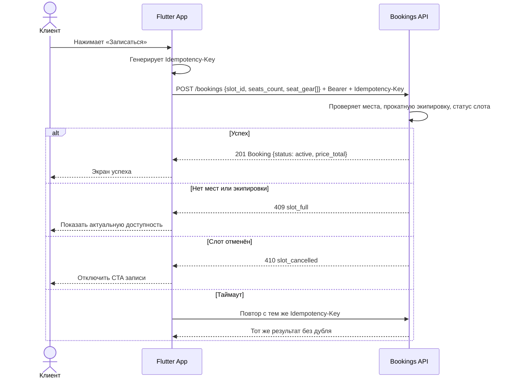
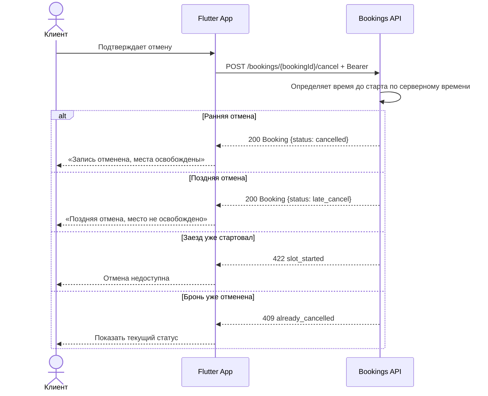
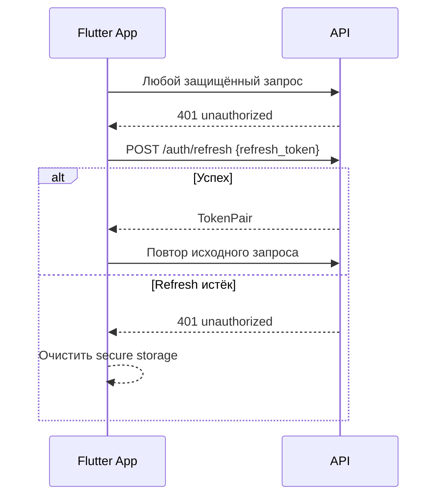

# Sequence-диаграммы API

> Этап 4. Критичные сценарии взаимодействия Flutter-клиента и API.

## Общие правила

- Все защищённые запросы используют `Authorization: Bearer <access_token>`.
- При `401` Flutter-клиент пытается обновить access token по refresh token.
- Создание брони всегда отправляется с `Idempotency-Key`.
- Сервер — источник истины по местам, прокатной экипировке, цене и времени.

## Сценарий 1: Создание брони

## Сценарий 2: Отмена брони

## Сценарий 3: Обновление access token

