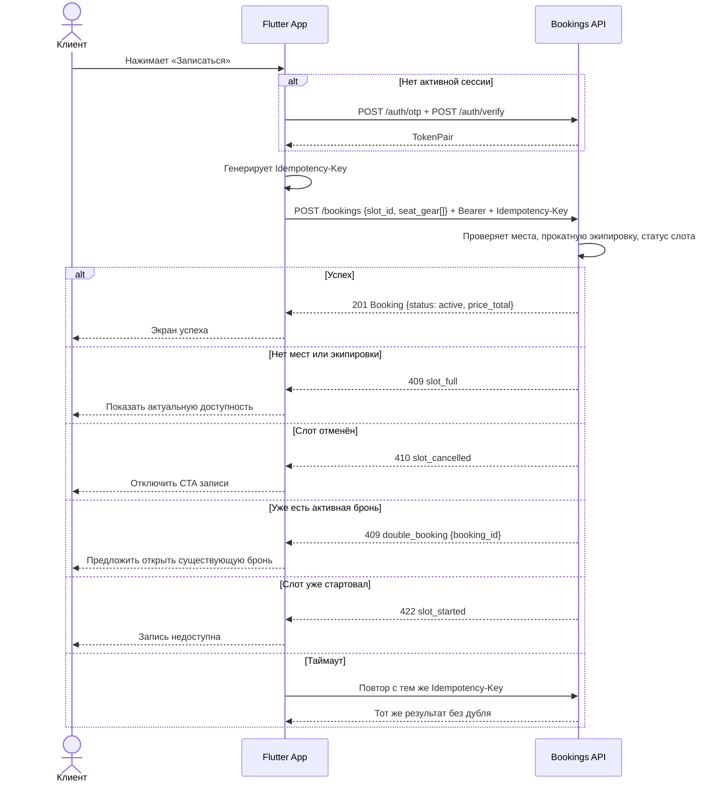
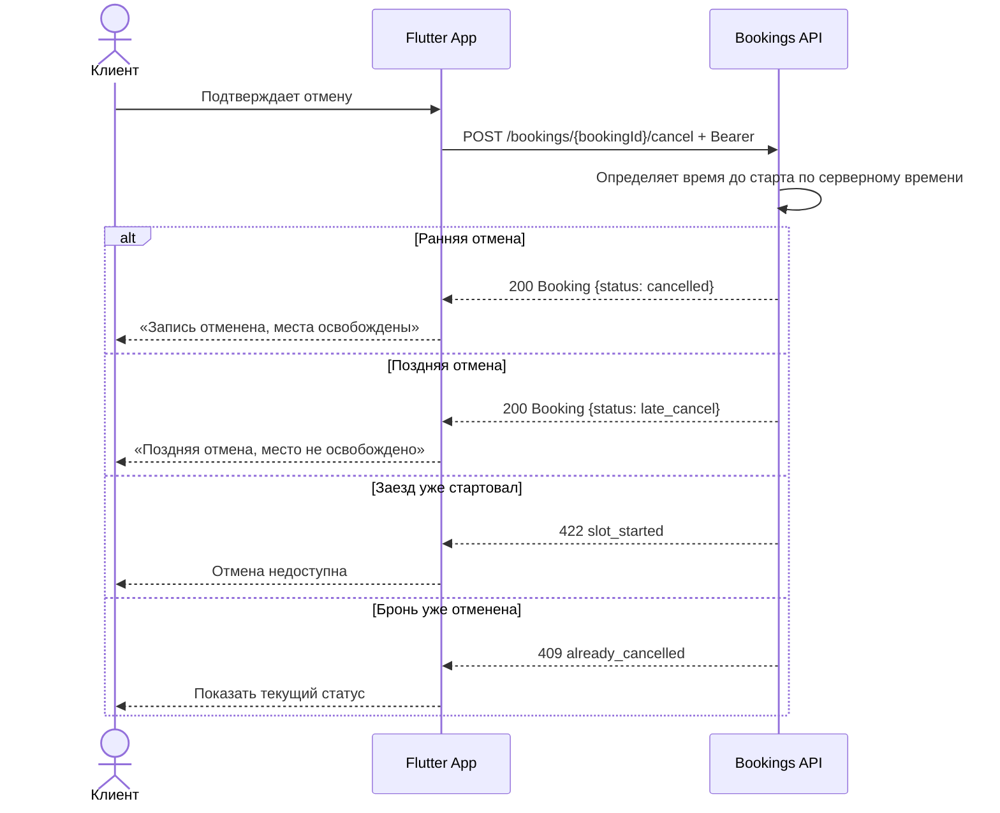
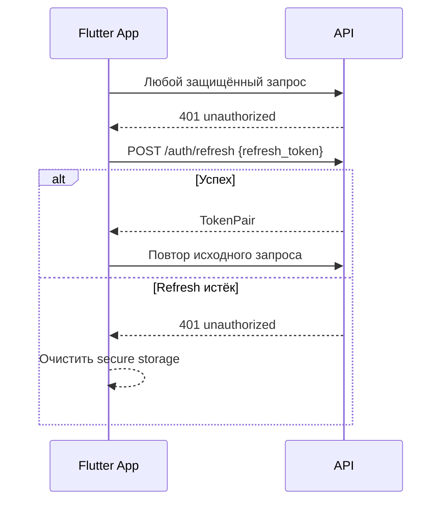
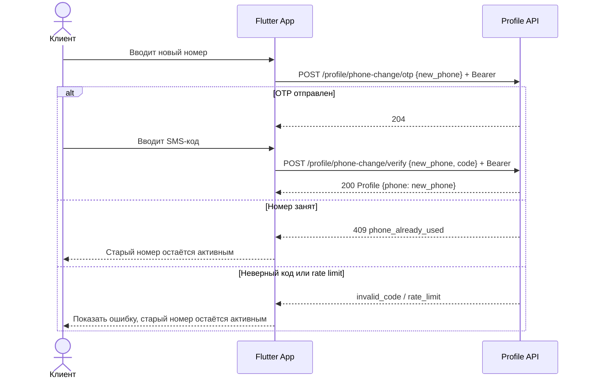

# Sequence-диаграммы API

> Этап 4. Критичные сценарии взаимодействия Flutter-клиента и API.

## Общие правила

- `GET /slots`, `GET /slots/{slotId}` и `GET /marshals` доступны без авторизации.
- Все персональные запросы и мутации используют `Authorization: Bearer <access_token>`.
- При `401` Flutter-клиент пытается обновить access token по refresh token.
- Создание брони всегда отправляется с `Idempotency-Key`.
- `createBooking` передаёт выбранные места массивом `seat_gear[]`; `seats_count` вычисляется сервером как длина массива.
- Сервер — источник истины по местам, прокатной экипировке, цене и времени.
- До создания брони клиент показывает локальный price preview; финальный `price_total` берётся только из ответа `createBooking`.

## Сценарий 1: Создание брони

## Сценарий 2: Отмена брони

## Сценарий 3: Обновление access token

## Сценарий 4: Смена телефона в профиле

