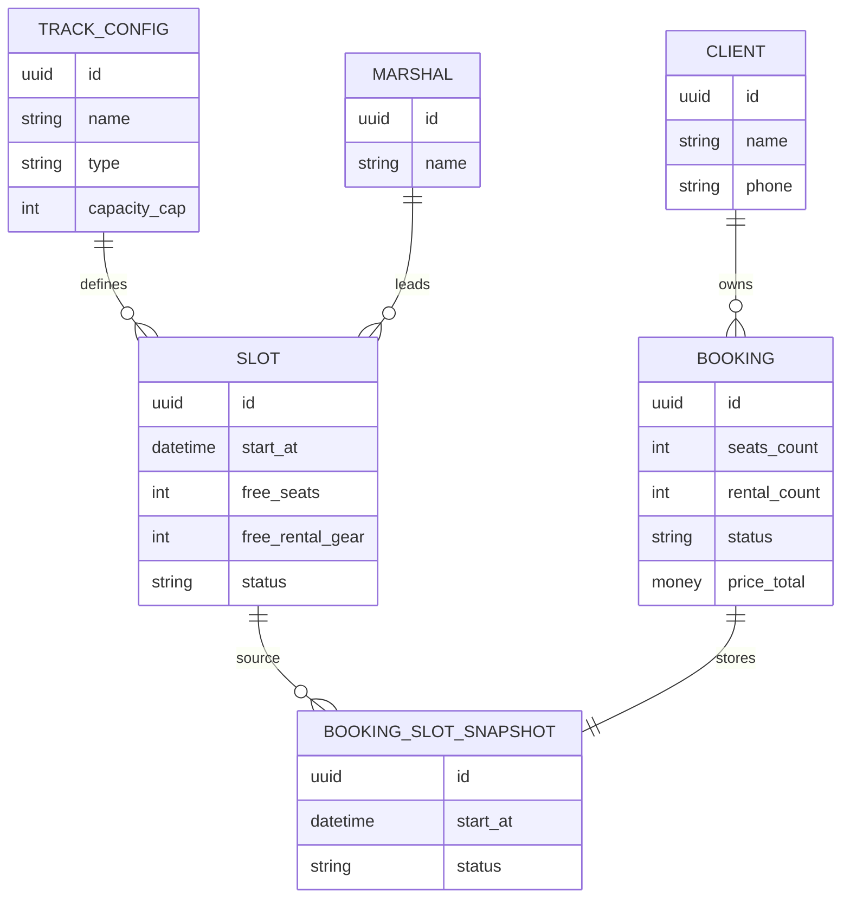

# Модель данных

> Этап 4. Ресурсная модель API для клиентского Flutter-приложения. Это не схема БД: хранение и бизнес-логика принадлежат существующей инфраструктуре.

## Сущности

### Client

| Атрибут | Тип | Описание |
| :-- | :-- | :-- |
| id | UUID | Идентификатор клиента |
| name | string | Имя |
| phone | string | Номер телефона, логин |
| created_at | datetime | Дата регистрации |

### TrackConfig

| Атрибут | Тип | Описание |
| :-- | :-- | :-- |
| id | UUID | Идентификатор конфигурации трассы |
| name | string | Название |
| description | string | Описание для карточки заезда |
| type | enum (`novice`, `experienced`) | Тип трассы |
| capacity_cap | int | Потолок мест: новичковая ≤8, опытная ≤14 (14 — предположение для опытной) |
| duration_min | int | Длительность заезда без/с учётом инструктажа, как отдаёт API |
| geometry | polyline | Контур/схема трассы для карты |

### Marshal

| Атрибут | Тип | Описание |
| :-- | :-- | :-- |
| id | UUID | Идентификатор маршала |
| name | string | Имя маршала |

### Slot

| Атрибут | Тип | Описание |
| :-- | :-- | :-- |
| id | UUID | Идентификатор слота |
| track_config | TrackConfig | Конфигурация трассы |
| marshal | Marshal | Назначенный маршал |
| start_at | datetime UTC | Время старта |
| total_seats | int | Всего мест |
| free_seats | int | Свободно мест |
| free_rental_gear | int | Свободно прокатных комплектов экипировки |
| price | money RUB | Цена за место |
| rental_price | money RUB | Цена проката одного комплекта экипировки |
| meeting_point | string | Место сбора |
| meeting_point_lat | float | Широта |
| meeting_point_lng | float | Долгота |
| status | enum (`scheduled`, `cancelled`) | Статус слота; `cancelled` означает отмену центром |
| cancel_reason | string? | Причина отмены центром |

### BookingSlotSnapshot

| Атрибут | Тип | Описание |
| :-- | :-- | :-- |
| id | UUID | Идентификатор исходного слота |
| track_config | TrackConfig | Snapshot конфигурации трассы на момент брони |
| marshal | Marshal | Snapshot назначенного маршала на момент брони |
| start_at | datetime UTC | Snapshot времени старта на момент брони |
| price | money RUB | Snapshot цены за место на момент брони |
| rental_price | money RUB | Snapshot цены проката на момент брони |
| meeting_point | string | Snapshot места сбора |
| meeting_point_lat | float? | Широта места сбора, если доступна |
| meeting_point_lng | float? | Долгота места сбора, если доступна |
| geometry | polyline? | Snapshot схемы трассы, если доступна |
| status | enum (`scheduled`, `cancelled`) | Актуализируемый статус слота для отмены центром |
| cancel_reason | string? | Актуализируемая причина отмены центром |

### Booking

| Атрибут | Тип | Описание |
| :-- | :-- | :-- |
| id | UUID | Идентификатор брони |
| client_id | UUID | Владелец брони |
| slot | BookingSlotSnapshot | Snapshot параметров слота для истории брони; статус/причина отмены центром могут актуализироваться |
| seats_count | int | Число мест, 1…`capacity_cap` (R-013) |
| rental_count | int | Число прокатных комплектов, не больше числа мест |
| seat_gear | array enum (`own`, `rental`) | Выбор экипировки по каждому месту |
| price_total | money RUB | Итоговая цена из API |
| status | enum | Статус брони |
| created_at | datetime | Дата создания |
| cancelled_at | datetime? | Дата отмены |
| cancel_reason | string? | Причина отмены |

## Статусы брони

| Статус | Значение |
| :-- | :-- |
| `active` | Активная предстоящая бронь |
| `cancelled` | Ранняя отмена клиентом, места освобождены |
| `late_cancel` | Поздняя отмена клиентом, места не освобождены |
| `cancelled_by_center` | Отмена центром/по погоде |
| `completed` | Заезд состоялся |

## ERD

## Правила

- `seats_count <= min(slot.free_seats, slot.track_config.capacity_cap)` (R-013).
- `rental_count <= slot.free_rental_gear`.
- `price_total` рассчитывает сервер.
- До создания брони клиент может показывать локальный preview: `slot.price * seats_count + slot.rental_price * rental_count`; после создания источником истины является `Booking.price_total`.
- `Booking.slot` — snapshot параметров слота на момент брони. Для отмены центром backend актуализирует `Booking.status`, `Booking.slot.status`, `cancel_reason`.
- Клиент не изменяет `Slot`, `TrackConfig`, `Marshal`.
- При удалении аккаунта к активным броням применяется обычная политика отмен: ранние становятся `cancelled`, поздние — `late_cancel`, начавшиеся/завершённые обрабатываются существующей инфраструктурой; исторические персональные данные анонимизируются.
