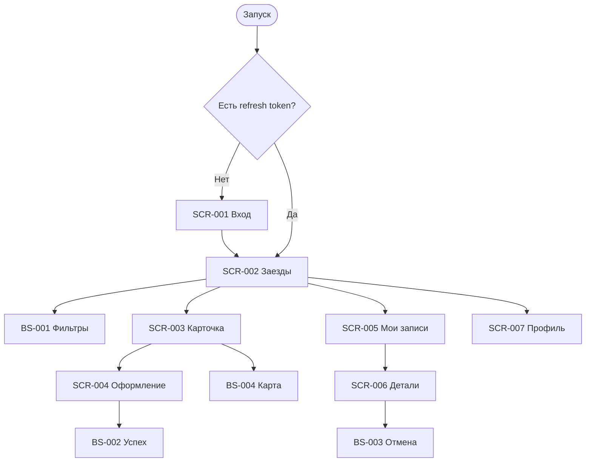

# Фича-лист Flutter-приложения «Апекс»

## Назначение

Клиентское приложение для самостоятельной записи на заезды картинг-центра. Скоуп — только роль Клиент.

## Карта навигации

## Фичи

| ID | Фича | Приоритет | API |
| :-- | :-- | :-- | :-- |
| F-001 | OTP-вход | Must | `sendOtp`, `verifyOtp` |
| F-002 | Список заездов | Must | `listSlots` |
| F-003 | Фильтры | Must | `listSlots`, `listMarshals` |
| F-004 | Карточка заезда | Must | `getSlot` |
| F-005 | Создание брони | Must | `createBooking` |
| F-006 | Мои записи | Must | `listBookings` |
| F-007 | Отмена брони | Must | `cancelBooking` |
| F-008 | Профиль | Must | `getProfile`, `updateProfile`, `deleteAccount` |
| F-009 | Push | Should | `registerPushToken` |
| F-010 | Карта трассы | Must | данные `geometry`, `meeting_point` |
